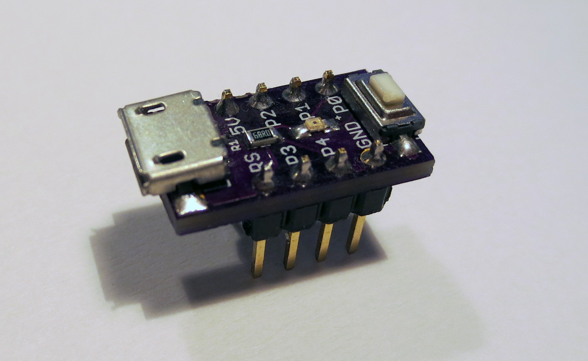

Nanite 85 
======

The Nanite 85, a nano-sized ATtiny85 devboard with USB Bootloader - most likely the smallest one ever.

The repository holds the Eagle circuit, PCB design data and a software example to handle the soft reset-button.

See [Blog post](http://cpldcpu.wordpress.com/2014/04/25/the-nanite-85/) for more information.

New
===

I teamed up with [Watterott](http://www.watterott.com) on making the Nanite 85 available for everyone. You can get one [here](http://www.watterott.com/de/Wattuino-Nanite85). Note that changes had to be made for manufacturability.

